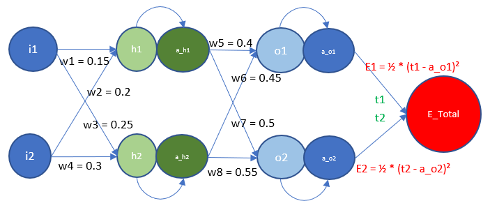

# ERA V1 - Session 6 - Assignment
School of AI - ERA V1 - Backpropagation

## Weights Calculations:
<p align="center">
  
  
</p>


<!-- ABOUT THE PROJECT -->
## About The Project

Session 6 - Backpropagation & Architectural Basics

### Built With

* Python
* Torch

<!-- GETTING STARTED -->
## Getting Started

S6.ipynb => Build model to predict numbers using MNIST dataset


### Prerequisites

* torch
  ```sh
  !pip install torch
  ```

<!-- USAGE EXAMPLES -->
## Usage

Open S6.ipynb file and 'Runtime -> Run All' to see the desired results


<!-- CONTRIBUTING -->
## Contributing

Contributions are what make the open source community such an amazing place to learn, inspire, and create. Any contributions you make are **greatly appreciated**.

If you have a suggestion that would make this better, please fork the repo and create a pull request. You can also simply open an issue with the tag "enhancement".
Don't forget to give the project a star! Thanks again!

1. Fork the Project
2. Create your Feature Branch (`git checkout -b feature/AmazingFeature`)
3. Commit your Changes (`git commit -m 'Add some AmazingFeature'`)
4. Push to the Branch (`git push origin feature/AmazingFeature`)
5. Open a Pull Request


<!-- LICENSE -->
## License

Distributed under the MIT License. See `LICENSE.txt` for more information.


<!-- CONTACT -->
## Contact

Damodara Reddy - damodarareddy_paila@hotmail.com

Project Link: https://github.com/damodarar/ERA1_PyTorch/tree/S6


<!-- ACKNOWLEDGMENTS -->
## Acknowledgments

Great start to learn NN from Rohan

* [School of AI]([https://choosealicense.com](https://theschoolof.ai/))
